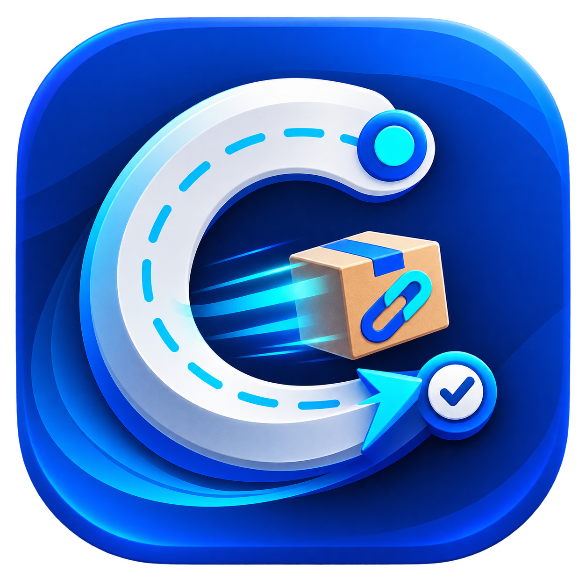
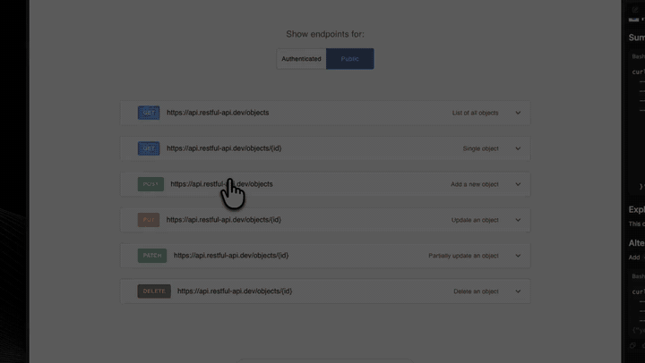

<p align="center">
  
</p>

<h1 align="center">Curlman</h1>

<p align="center">
  Paste a cURL command. Edit it. Send it. Find it again later.
</p>

<p align="center">
  A fast, local-first API client available as a native macOS menu-bar app and a consistent Electron app for macOS, Windows, and Linux.
</p>

<p align="center">
  <a href="https://github.com/Raunaks068619/curlman/actions/workflows/ci.yml"></a>
  <a href="https://github.com/Raunaks068619/curlman/releases/latest"></a>
  
  
  <a href="LICENSE"></a>
</p>

## See it in action

<p align="center">
  <a href="https://github.com/Raunaks068619/curlman/releases/latest/download/Curlman-POST-Demo.mp4">
    
  </a>
</p>

Paste a multiline POST request, inspect its formatted JSON body, send it with the keyboard, and read the syntax-highlighted response. Click the demo for the full-quality video.

## Choose your edition

| | Native macOS | Electron |
| --- | --- | --- |
| Best for | Daily use on a Mac | A consistent app on macOS, Windows, and Linux |
| Built with | Swift, SwiftUI, AppKit | Electron, React, TypeScript |
| Runs from | Downloadable DMG | Source with Node.js and npm |
| Desktop behavior | Menu-bar panel, Keychain, native networking | Tray app, encrypted credential vault, Electron networking |
| Requirements | Apple Silicon or Intel, macOS 14+ | Node.js 22.12+ |
| Start | [Download the DMG](https://github.com/Raunaks068619/curlman/releases/latest/download/Curlman.dmg) | `npm install && npm run dev` |

Both editions share the same focused workflow, automatic history, editable requests, cURL export, compact mode, and keyboard-first interaction.

## Install the native macOS app

### [Download Curlman.dmg](https://github.com/Raunaks068619/curlman/releases/latest/download/Curlman.dmg)

1. Open `Curlman.dmg`.
2. Drag **Curlman** into Applications.
3. On the first launch, Control-click Curlman, choose **Open**, then confirm.
4. Use the menu-bar icon or press `⌘⇧C` to show the panel.

The public DMG is ad-hoc signed and is not Apple-notarized yet. The Control-click step is normally required only once.

## Run the Electron app

Install [Node.js 22.12 or newer](https://nodejs.org/), then:

```sh
git clone https://github.com/Raunaks068619/curlman.git
cd curlman
npm install
npm run dev
```

Electron opens as a tray/menu-bar utility and stays out of the Dock or taskbar. The same source and commands work on macOS, Windows, and Linux.

> Prebuilt Electron installers are not published yet. The current cross-platform path runs directly from source.

## The workflow

1. Open Curlman with the global shortcut or tray icon.
2. Paste a URL or complete cURL command without clicking the input first.
3. Edit the method, params, headers, body, or authentication.
4. Press `⌘↵` on macOS or `Ctrl+Enter` on Windows/Linux.
5. Curlman opens a full-width Response tab with status, timing, headers, and formatted output.
6. Every execution is automatically available in History.

The response interface stays hidden until a response exists. History is an on-demand tab rather than a permanent sidebar.

## Features

- Import multiline cURL commands without executing them in a shell.
- Edit GET, POST, PUT, PATCH, DELETE, HEAD, and OPTIONS requests.
- Edit query params, headers, JSON, raw, form URL-encoded, or multipart bodies.
- Use Bearer, Basic, or API-key authentication with secrets stored in Keychain.
- Control request timeout, redirects, and cookie-session behavior.
- Automatically format imported JSON with syntax highlighting.
- Copy the currently edited request back to a runnable cURL command.
- Inspect pretty or raw responses and response headers.
- Retain request and response history automatically.
- Search, restore, rerun, pin, and remove history entries.
- Minimize into a fixed compact command strip.
- Choose a custom global shortcut in Settings.
- Follow system light/dark appearance, fonts, accent color, and accessibility settings.
- Keep requests, history, and credentials local to the machine.

## Supported cURL imports

Curlman currently understands the common request flags below:

```text
-X, --request
--url
-H, --header
-d, --data, --data-raw, --data-binary
--data-urlencode
-F, --form
-G, --get
-u, --user
-L, --location, --location-trusted
```

URL query strings are moved into editable Params. JSON bodies are formatted automatically. With `--get`, URL-encoded data is converted into query params.

Unsupported flags are shown as warnings instead of being silently executed. Imported multipart files remain blocked until you explicitly approve access in the request editor.

## Keyboard shortcuts

| Action | macOS | Windows/Linux |
| --- | --- | --- |
| Show or hide Curlman | `⌘⇧C` | `Ctrl+Shift+C` |
| Send request | `⌘↵` | `Ctrl+Enter` |

Change the global shortcut from Settings. Curlman keeps the previous shortcut if the new combination is already used by another application.

## Privacy and security

- Requests go directly from Curlman to the destination API. There is no Curlman cloud service.
- Pasted cURL commands are tokenized and parsed. They are never passed to a shell.
- History is stored locally in SQLite.
- Authentication secrets are excluded from persisted history snapshots.
- Native credentials use macOS Keychain. Electron credentials use its OS-backed encrypted storage.
- Copying as cURL intentionally places the current authentication value on the system clipboard.

## Development

### Electron

```sh
npm install
npm run dev
```

Run its checks and create a local package:

```sh
npm run typecheck
npm run lint
npm test
npm run package:electron
```

Electron source lives in [`apps/electron`](apps/electron). CI runs type checking, linting, and tests on macOS, Windows, and Linux.

### Native macOS

The native app requires macOS 14+ and Xcode 15 or newer. Release builds are universal for Apple Silicon and Intel.

```sh
swift test
./scripts/build-release.sh
```

The release script creates `Curlman.app`, `Curlman.dmg`, and its checksum in `outputs/`.

## Project structure

```text
Sources/CurlmanNative/   Native Swift application
apps/electron/           Cross-platform Electron application
Brand/                   App and tray icons
Media/                   README demo media
Tests/                   Native Swift tests
scripts/                 Packaging and verification scripts
```

## Current limitations

- The native DMG is not notarized with an Apple Developer ID.
- Electron installers are not yet published for Windows or Linux.
- Client certificates, proxy settings, cookie jars, and shell substitutions are not currently imported.

## Contributing

Issues and focused pull requests are welcome. Please run the relevant native or Electron checks before opening a pull request, and avoid committing API keys, tokens, or real customer payloads.

## License

Curlman is available under the [MIT License](LICENSE).
